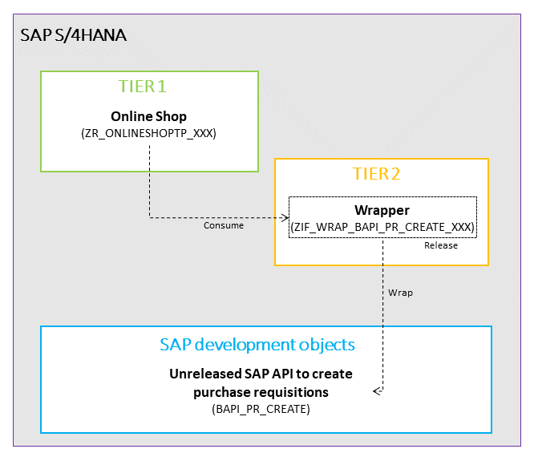
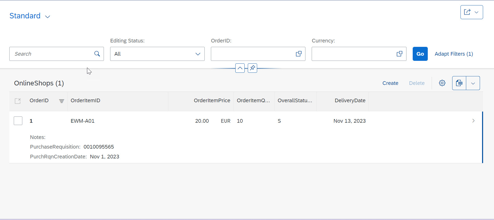

# Understand the scenario

In this exercise,  you will develop a simple custom app (Online Shop) following ABAP Cloud development model. When the online shop entry is saved, a purchase requistion is created with the ordered item selected by the user. 
Assuming there is no released API available for purchase requisition, we will create a wrapper in Tier 2 (API Enablement layer) and release it for consumption in cloud. The online shop shall use the wrapper created in Tier 2 to post the purchase requisition.

><b>Note</b>:
The exercise follows the assumption that there is no suitable released API to create purchase requisitions, and we therefore need to find and wrap an unreleased API as a suitable alternative. Please be aware that we follow this assumption simply for illustrative purposes, as SAP does indeed provide a released API to create purchase requisitions (<a href="https://developers.sap.com/tutorials/abap-s4hanacloud-purchasereq-integrate-api.html">see Integrate released purchase requisition API into Online Shop Business Object</a>).                                                                        

>The scenario has been developed for training purposes only and might not reflect all the complexity of a real-world scenario. The focus in these hands-on session is purely on technical knowledge transfer and therefore optimizations from a business perspective are not part of the training and the scenario will not be further assessed. 

## Result
You will have created an online shop entry which will post a purchase requisition using the wrapper over the not released BAPI (BAPI_PR_CREATE).

### Next Step
Continue to - [Exercise 1 - Implement wrapper for Purchase Requisition BAPI BAPI_PR_CREATE](../ex1/README.md)
