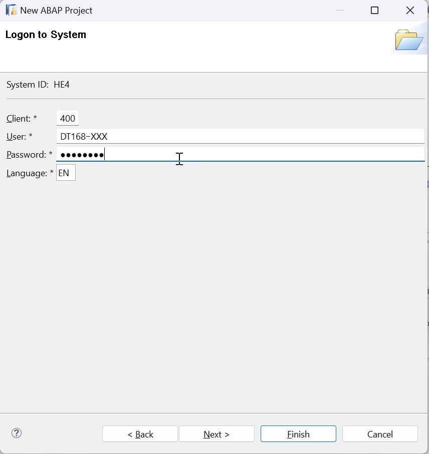

# Exercise 1 - Implement wrapper for Purchase Requisition BAPI BAPI_PR_CREATE
In this exercise, we will create an interface to implement the wrapper class, the wrapper class and a factory class to instantiate the wrapper class. We will then release the interface and the factory class for Use in Cloud.
## [Exercise 1.0 Add system connection to ADT](#exercise-10-add-system-connection-to-adt-1)  
## [Exercise 1.1 Create Package $Z_PURCHASE_REQ_TIER2_XXX](#exercise-11-create-package) 
## [Exercise 1.2 Create wrapper Interface ZIF_BAPI_PR_WRAPPER_XXX](#exercise-12-create-wrapper-interface)
## [Exercise 1.3 Create wrapper Class ZCL_WRAP_BAPI_PR_CREATE_XXX](#exercise-13-create-wrapper-class)  
## [Exercise 1.4 Create factory Class ZCL_BAPI_WRAP_FACTORY_XXX](#exercise-14-create-factory-class)  
## [Exercise 1.5 Release Interface and Factory class](#exercise-15-release-interface-and-factory-class-1) 
## [Summary](#summary)

## Exercise 1.0 Add system connection to ADT
  
1.	Open Eclipse
2.	Add ABAP perspective to the IDE - Click on **Search** icon on the toolbar and type **ABAP** and select the entry **ABAP** under the perspectives
   

3.	Select the ABAP Perspective to have the set of views related to ABAP development configured in the IDE
4.	Click on the option **Create an ABAP Project** ( if this is the first system that is being connected in the ADT workspace ).

  	If connections to other systems already exist in the project explorer, right-click in the **Project Explorer** view and select option **New** -> **ABAP Project** to get the **New ABAP Project** wizard to add the project ( system ) to the workspace.
   
   
6.	In the **New ABAP Project** wizard, click on **New system connection** hyperlink
   
   
7.	Enter the following details in the **New ABAP Project Wizard** and click **Next**

   - **System ID** : **`HE4`**
   - **Connection Type** : Choose **Custom Application Server** from the drop down menu
   - **Application Server** : **`s4hana1.tdc.sap.com`**
   - **Instance Number** : **`00`**
   - Uncheck option "Activate Secure Network Communication (SNC) as show in the screenshot below
   
   
7.	In following step, enter the details given below and click **Next**
   - **Client** : **`400`**
   - Enter the user credentials DT168-<GroupId> / Welcome1!
   
   
8.	In following step, enter the details given below and click **Finish**
   - **Project Name** : **`HE4_400_DT168_EN`**
   
   

9.	A project with the name **HE4_400_DT168_EN** will now be available under the Project Explorer representing an active connection to the backend system
    
   
  

## Exercise 1.1 Create Package  
1. In ADT, Goto **Project Explorer**. From the context menu of the ABAP Project, select **New -> ABAP Package**.  
   &emsp;**Give the below information:**  
   &emsp;&emsp;**Name:** $Z_PURCHASE_REQ_TIER2_XXX  
   &emsp;&emsp;**Description**: Tier 2 for Purchase Requisition Wrapper  
   &emsp;&emsp;Select **Add to favorite package**  
   &emsp;&emsp;**Super Package**: $ZAPI_ENABLEMENT   
   &emsp;&emsp;**Package Type**: Development   
      
   &emsp;
   
1. Press **Next** and verify the SWC is LOCAL
2. Press **Next** and **Finish**

## Exercise 1.2 Create wrapper Interface  
1. Select the package **$Z_PURCHASE_REQ_TIER2_XXX** and from the context menu, select **New -> ABAP Interface**.  
&emsp;**Give the below information:**  
&emsp;&emsp;**Name**: ZIF_BAPI_PR_WRAPPER_XXX  
&emsp;&emsp;**Description**: Wrapper Interface for BAPI_PR_CREATE  
   
&emsp;&emsp;

2. Choose **Next** and **Finish**  
3. Insert the code from [here](../src/zif_bapi_pr_wrapper_xxx.txt) and activate  
   
## Exercise 1.3 Create Wrapper Class   
1. Select the package **$Z_PURCHASE_REQ_TIER2_XXX** and from the context menu, select **New -> ABAP Class**.  
&emsp;**Give the below information:**  
&emsp;&emsp;**Name**: ZCL_WRAP_BAPI_PR_CREATE_XXX  
&emsp;&emsp;**Description**: Wrapper Class for BAPI_PR_CREATE
  
&emsp;&emsp;

&emsp;&emsp;Click on **Add..** and give the interface ZIF_BAPI_PR_WRAPPER_XXX created in previous step  
3. Choose **Next** and **Finish**  
4. Insert the code from [here](../src/zcl_wrap_bapi_pr_create_xxx.txt)  and activate  
    
## Exercise 1.4 Create factory Class  
1. Select the package **$Z_PURCHASE_REQ_TIER2_XXX** and from the context menu, select **New -> ABAP Class**.  
&emsp;**Give the below information:**  
&emsp;&emsp;**Name**: ZCL_BAPI_WRAP_FACTORY_XXX  
&emsp;&emsp;**Description**: Factory Class for Wrapper 
  

2. Choose **Next** and **Finish**  
3. Insert the code from [here](../src/zcl_bapi_wrap_factory_xxx.txt)  and activate
   
## Exercise 1.5 Release Interface and Factory Class
1. Goto **Properties** of Interface zif_bapi_pr_wrapper_xxx, select **API State** and add Contract C1
   
   

3. Similarly, set Release Contract C1(for Use in Cloud) for the Factory Class zcl_bapi_wrap_factory_xxx
       
## Summary       
You've now created a Tier 2 wrapper on an unreleased BAPI and released for Use in Cloud.  
Continue to - [Exercise 2 - Create Online Shop application](../ex2/README.md)  
