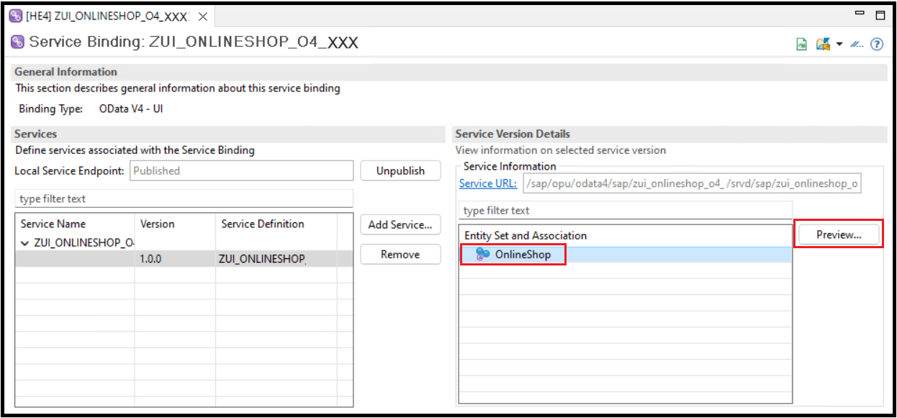
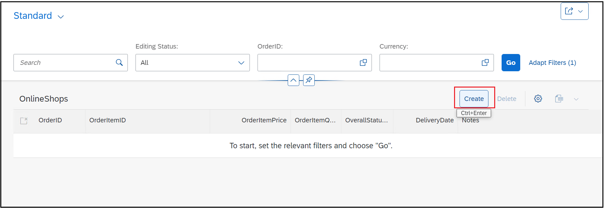
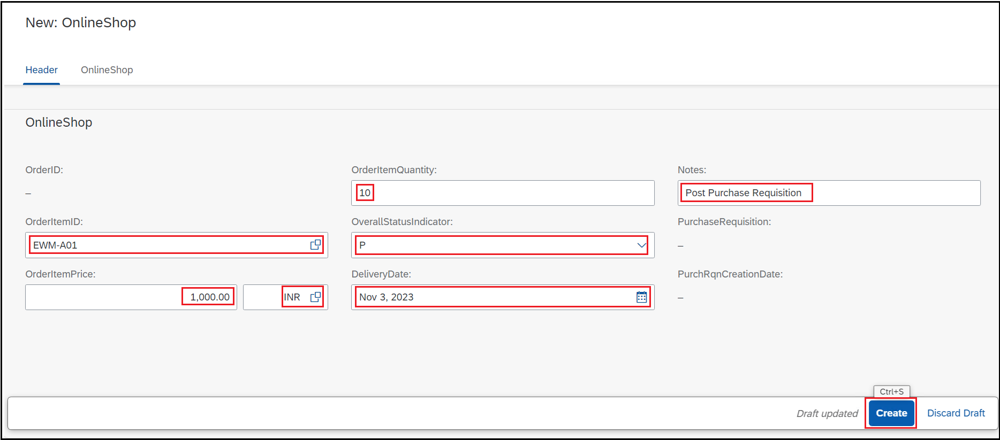
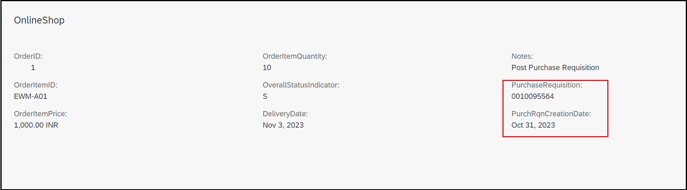

# Exercise 3 - Enhance the Online Shop BO to post Purchase Requisition
When the user sets the status of the Online shop to P(Post), create Purchase Requisition using the wrapper created in Exercise 1

## [Exercise 3.1 Enhance the BO for validation and posting of the Purchase Requisition](#exercise-31-enhance-the-bo-for-validation-and-posting-of-the-purchase-requisition-1)  

## [Exercise 3.2 Test the Online Shop application](#exercise-32-test-the-online-shop-application-1)  

## [Summary](#summary)
  

## Exercise 3.1 Enhance the BO for validation and posting of the Purchase Requisition

1. In the behavior definition ZR_ONLINESHOP_XXX, change the strict mode to strict(1) from strict(2).In case of S/4HANA 2022 FPS01, strict(1) mode must be used.

    ```
    managed implementation in class ZBP_R_ONLINESHOP_XXX unique;
    strict ( 1 );
    with draft;
    ```
   Change the strict mode version to strict(1) from strict(2) in projection behavior definition ZC_ONLINESHOP_XXX 

    ```
    projection;
    strict ( 1 );
    use draft;
    ```
2. Change the implementation to "Unmanaged Save". Refer the below code snippet.

  ```
  define behavior for ZR_ONLINESHOP_XXX alias OnlineShop
  //persistent table zaonlineshop_xxx  
  draft table zdonlineshop_xxx
  etag master LocalLastChangedAt
  lock master total etag LastChangedAt
  authorization master ( global )
  with unmanaged save  
  ```

3. Add constants for Online shop status in the global class of ZBP_R_ONLINESHOP_XXX

```
CLASS zbp_r_onlineshop_xxx DEFINITION
  PUBLIC
  ABSTRACT
  FINAL
  FOR BEHAVIOR OF zr_onlineshop_xxx .

  PUBLIC SECTION.
    CONSTANTS:
      BEGIN OF c_overall_status,
        inprocess TYPE zos_status VALUE '',
        post      TYPE zos_status VALUE 'P',
        submitted TYPE zos_status VALUE 'S',
      END OF c_overall_status.
  PROTECTED SECTION.
  PRIVATE SECTION.
ENDCLASS.

```

4. Add validation to check errors in purchase requisition

  i. Add validation to the Behavior definition
  
  ```
    create;
    update;
    delete;
  
    validation checkPurchaseRequisition on save {create;}
    determination CalculateOrderID on save { create; }
  ```
  
  ```
    //  draft determine action Prepare;
    draft determine action Prepare { validation checkPurchaseRequisition; }
  ```
  ii. Place the cursor on checkPurchaseRequisition in behavior definition and add the validation method checkPurchaseRequisition through quick assist(press ctrl+1) to the behavior implementation class. Add the following code in the method.

  ```
  METHOD checkPurchaseRequisition.
      
    READ ENTITIES OF zr_onlineshop_XXX IN LOCAL MODE
      ENTITY OnlineShop
        ALL FIELDS WITH
        CORRESPONDING #( keys )
      RESULT DATA(OnlineOrders).

    LOOP AT OnlineOrders INTO DATA(OnlineOrder) WHERE OverallStatusIndicator = zbp_r_onlineshop_XXX=>c_overall_status-post.
      DATA(pr_returns) = zcl_bapi_wrap_factory_xx=>create_instance( )->check(
          EXPORTING
            pr_header        = VALUE zif_wrap_bapi_pr_create_xx=>pr_header( pr_type = 'NB' )
            pr_items         = VALUE zif_wrap_bapi_pr_create_xx=>pr_items( (
              preq_item  = '00010'
              plant      = '1710'
              acctasscat = 'U'
              currency   = OnlineOrder-Currency
              deliv_date = OnlineOrder-DeliveryDate
              material   = OnlineOrder-OrderItemID
              matl_group = 'L001'
              preq_price = OnlineOrder-OrderItemPrice
              quantity   = OnlineOrder-OrderItemQuantity
              unit       = 'EA'
              pur_group = '001'
              purch_org = '1010'
              short_text = OnlineOrder-Notes
            ) )

        ).

      LOOP AT pr_returns INTO DATA(pr_return_msg) WHERE type = 'E' OR type = 'W'.
        APPEND VALUE #(
          orderuuid = OnlineOrder-OrderUUID
          %msg = new_message(
                        id        = pr_return_msg-id
                        number    = pr_return_msg-number
                        severity  = COND #( WHEN pr_return_msg-type = 'E' THEN if_abap_behv_message=>severity-error
                                            WHEN pr_return_msg-type = 'W' THEN if_abap_behv_message=>severity-warning
                                             )
                         v1 = pr_return_msg-message_v1
                         v2 = pr_return_msg-message_v2
                         v3 = pr_return_msg-message_v3
                         v4 = pr_return_msg-message_v4  )
          %element-purchaserequisition = if_abap_behv=>mk-on
           ) TO reported-onlineshop.

        IF pr_return_msg-type = 'E' OR pr_return_msg-type = 'A'.

          APPEND VALUE #(
           orderuuid = OnlineOrder-OrderUUID
           %fail = VALUE #( cause = if_abap_behv=>cause-unspecific )
          ) TO failed-onlineshop.

        ENDIF.
      ENDLOOP.
    ENDLOOP.
  ENDMETHOD.

  ```

5. Place the cursor on `with unmanaged save` in behavior definition . 
Add save_modified method to the behavior implementation through quick assist (press ctrl + 1) and add the code as below

  ```
  METHOD save_modified.
    DATA online_shop   TYPE STANDARD TABLE OF zaonlineshop_XXX.
    DATA lr_descr_struc TYPE REF TO data.
    DATA lo_structdescr TYPE REF TO cl_abap_structdescr.
    DATA r_online_shop_old TYPE zr_onlineshop_XXX.
    IF create-onlineshop IS NOT INITIAL.
      online_shop = CORRESPONDING #( create-onlineshop MAPPING FROM ENTITY ).
    ENDIF. 
    IF update-onlineshop IS NOT INITIAL.
      SELECT * FROM zaonlineshop_XXX
             FOR ALL ENTRIES IN @update-onlineshop
             WHERE order_uuid = @update-onlineshop-OrderUUID
             INTO TABLE @DATA(online_shop_old_t).

      CREATE DATA lr_descr_struc TYPE zr_onlineshop_XXX. " <- any type
      lo_structdescr ?= cl_abap_structdescr=>describe_by_data_ref( p_data_ref = lr_descr_struc ).
      LOOP AT update-onlineshop ASSIGNING FIELD-SYMBOL(<onlineshop_new>).
        DATA(online_shop_old) = online_shop_old_t[ order_uuid = <onlineshop_new>-OrderUUID ].
        r_online_shop_old = CORRESPONDING #( online_shop_old MAPPING TO ENTITY ).
        LOOP AT lo_structdescr->components ASSIGNING FIELD-SYMBOL(<comp>).
          ASSIGN COMPONENT <comp>-name OF STRUCTURE <onlineshop_new>-%control TO FIELD-SYMBOL(<fld_cntrl>).
          IF <fld_cntrl> IS ASSIGNED AND <fld_cntrl> = '01'.
            ASSIGN COMPONENT <comp>-name OF STRUCTURE <onlineshop_new> TO FIELD-SYMBOL(<new_value>).
            ASSIGN COMPONENT <comp>-name OF STRUCTURE r_online_shop_old TO FIELD-SYMBOL(<old_value>).
            <old_value> = <new_value>.
          ENDIF.
        ENDLOOP.
        APPEND CORRESPONDING #( r_online_shop_old MAPPING FROM ENTITY ) TO online_shop.
      ENDLOOP.
    ENDIF.

    LOOP AT online_shop ASSIGNING FIELD-SYMBOL(<online_shop>) WHERE overall_status_indicator = zbp_r_onlineshop_XXX=>c_overall_status-post.
      DATA pr_returns TYPE zif_wrap_bapi_pr_create_xx=>pr_returns.
      <online_shop>-purchase_requisition = zcl_bapi_wrap_factory_xx=>create_instance( )->create(
        EXPORTING
          pr_header        = VALUE zif_wrap_bapi_pr_create_xx=>pr_header( pr_type = 'NB' )
          pr_items         = VALUE zif_wrap_bapi_pr_create_xx=>pr_items( (
            preq_item  = '00010'
            plant      = '1710'
            acctasscat = 'U'
            currency   = <online_shop>-Currency
            deliv_date = <online_shop>-Delivery_Date
            material   = <online_shop>-order_item_id
            matl_group = 'L001'
            preq_price = <online_shop>-order_item_price
            quantity   = <online_shop>-order_item_quantity
            unit       = 'EA'
            pur_group = '001'
            purch_org = '1010'
            short_text = <online_shop>-notes
          ) )
        IMPORTING
          pr_returns    = pr_returns
      ).

      ASSERT NOT line_exists( pr_returns[ type = 'E' ] ).
      <online_shop>-purch_rqn_creation_date = cl_abap_context_info=>get_system_date(  ).
      <online_shop>-overall_status_indicator = zbp_r_onlineshop_XXX=>c_overall_status-submitted.
    ENDLOOP.

    MODIFY zaonlineshop_XXX FROM TABLE @online_shop.

    LOOP AT delete-onlineshop INTO DATA(onlineshop_delete) WHERE OrderUUID IS NOT INITIAL.
      DELETE FROM zaonlineshop_XXX WHERE order_uuid = @onlineshop_delete-OrderUUID.
      DELETE FROM zdonlineshop_XXX WHERE orderuuid = @onlineshop_delete-OrderUUID.
    ENDLOOP.

  ENDMETHOD.

  ```
6. Implement Instance features to disable edit once Purchase order is posted for the online shop entry
i. In the behavior definition ZR_ONLINESHOP_XXX, change as below:
```
  create;
//  update;
  update (features : instance);
  delete;

```
ii. Press **Ctrl+1** on behavior definition ZR_ONLINESHOP_XX to load quick assist proposal to generate get_instance_features method to the implementation. Add the below code.

```
METHOD get_instance_features.

    READ ENTITIES OF zr_onlineshop_XXX IN LOCAL MODE
      ENTITY OnlineShop
         FIELDS (  OrderUUID OverallStatusIndicator )
         WITH CORRESPONDING #( keys )
       RESULT DATA(OnlineShops)
       FAILED failed.

    result = VALUE #( FOR OnlineShop IN OnlineShops
                       ( %tky                           = onlineshop-%tky
                         %features-%update = COND #( WHEN onlineshop-OverallStatusIndicator = zbp_r_onlineshop_xxx=>c_overall_status-submitted
                                                        THEN if_abap_behv=>fc-o-disabled
                                                        ELSE if_abap_behv=>fc-o-enabled  )
                      ) ).

ENDMETHOD.

```
7. Find the final behavior definition code [here](../src/zr_onlineshop_xxx_bd.txt)
8. Find the final behavior implementation code [here](../src/zbp_r_onlineshop_xxx.txt)

## Exercise 3.2 Test the Online Shop application

Go to Service binding ZUI_ONLINESHOP_O4_XXX, preview on the entity OnlineShop and test the application.

> Now, check the local service endpoint of your service binding **`ZUI_ONLINESHOP_O4_XXX`**, and use the preview to test the _Online Shop_ app by creating a purchase order.

 <details>
  <summary>🔵 Click to expand!</summary>

1. Go to Service binding ZUI_ONLINESHOP_O4_XXX and start the **_Fiori elements App Preview_** for the **`OnlineShop`** entity set.
 
    For that, either select the entity set **`OnlineShop`** in the **Entity Set and Associations** section and press the **Preview** button or simply doubleclicking on it.
 
    The _Online Shop_ app will be started in your browser.
    
        

2. Create a new order and fill the order details as shown. Use value helps and drop downs wherever available.

        
        

3. Observe the created purchase requisition and auto-updated purchase requisition creation date.
        


## Summary
We have now used the 3 tier model to mitigate limitation of unreleased BAPIs. 
